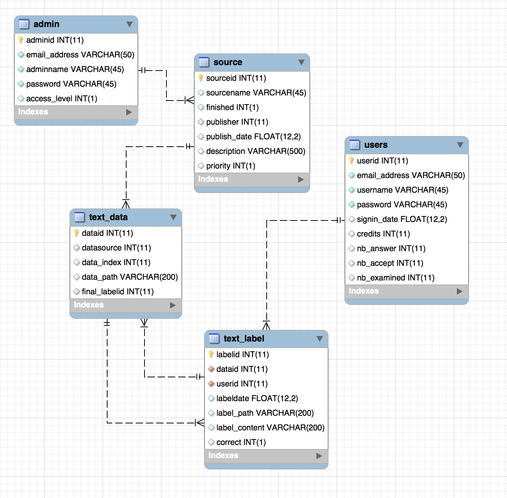

# `sql_conn` Usage

### 1. Object

- Creation :

  `cnx = connection.MySQLConnection(user = '', password = '', host = '', database = '')`

  `c = sql_conn(cnx)`

- Close : `c.close()`

### 2. Database Instructions

**ER Diagram of database**

#### 2.1 Table `users`

- `nb_answer` : Total number of questions answered by user
- `nb_accept` : Total number of user's accepted answer 

#### 2.2 Table `admin`

- `access_level` : **1** normal admin; **2** super admin

#### 2.3 Table `source`

- `publisher` : foreign key, reference to `adminid`  in table **`admin`**
- `priority` : **1** low (default); **2** normal; **3** high
- `nb_json` : Total number of `.json` file uploaded, i.e., total number of questions
- `nb_finished` : Total number of questions that have accepted answers. 
  - The **progress rate** is calculated by `nb_finished`/`nb_json`
- `fault_tolerance_degree` : **0** turn off (default); **1** low degree; **2** high degree

#### 2.4 Table `text_data`

The table is used to store all data (questions to be answered) from each source

- `datasource` : Foreign key, reference to `sourceid` in table **`source`**
- `data_index` : For each source, every data should have a unique **index** . `data_index` is the index in the souece the data belongs to.
- `dataid` is the primary key. The combination of `datasource` and `data_index` should also be **unique**
- `data_path` : The abosolute path of the `.json` data file.
- `final_labelid` : Foreign key, reference to `labelid` in table **`text_label` **. If the question has an accepted answer, the `final_labelid` should point to one of the accepted answer's `labelid` in table **`text_label` **. Else `final_labelid = NULL` as it is initialized.
- `nb_label` : abandoned.

#### 2.5 Table `text_label`

- `dataid` : Foreign key, reference to `dataid` in table **`text_data`**. The corresponding data of this label.
- `userid` : Foreign key, reference to `userid` in table **`users`**. Data labeler.
- `label_path` The abosolute path of the `.json` label file.
- `label_content` : Part extracted from the `.json` file. We do **fault-tolerance** process on only this part.
- `correct` : Whether the answer is accepted. **0** incorrect/not determined yet (defualt); **1** correct. 

### 3. Methods

**All methods return `None` if fails unless otherwise stated**

#### 3.1 User Utility

- `get_all_user(self)`
  
  return all users
  
- `get_user(self, userid=None, username=None, user_email=None)`

  return all the information of the corresponding user
  
- `ger_user_number(self)`

  return the total number of users

- `get_user_id(self, username=None, user_email=None)` 

- `get_user_email(self, userid=None, username=None)`

- `get_user_name(self, userid=None, user_email=None)`

- `get_user_passwd(self, userid=None, username=None, user_email=None)`

- `get_user_credit(self, userid=None, username=None, user_email=None)`

- `get_user_nb_accept(self, userid=None, username=None, user_email=None)`
  
   return number of accepted answer of the user

- `set_user_nb_accept(self, userid, addoffset=1)`

  set user's `nb_accept` to `nb_accept+addoffset` , default `addoffset=1`
  
- `get_user_nb_answer(self, userid=None, username=None, user_email=None)`

   return the user's total number of answers 

- `get_user_nb_val(self, userid=None, username=None, user_email=None)`

- `get_user_nb_val_tp(self, userid=None, username=None, user_email=None)`
  
   return `val_tp` of the user
   
- `get_user_val_acc(self,userid=None, username=None, user_email=None)`

   return the validation accuracy 
   
- `get_user_accept_rate(self,userid=None, username=None, user_email=None)`

   return the accept rate 

- `insert_user(self, username, user_email, passwd, signin_time=get_timestamp(), credits=0, nb_accept=0, nb_answer=0, nb_examined=0)`

  - default `signin_time` is current time
  - default `credits` is 0
  - default `nb_accept`, `nb_answer` and `nb_examined` are 0, i.e. the default number of accepted answer is 0.
  - insertion operations return : **1** success; **0** already exist; **-1** fail

- `user_exist(self, userid=None, username=None, user_email=None)`

  return `True` if the user exists otherwise `False`
  
- `get_user_credit_rank(self, user_email)`

   return user credits rank
   
- `set_user_nb_answer(self, user_email, addoffset)`

   - set user answer count `nb_answer` to original value `+= addoffset`
   
   - return : **1** success;  **-1** fail
   
- `get_user_source(self, user_email)`

   Get the labeling task the user participated. Return a list of `sourceid`
   
- `get_user_mainpage_pan(self, user_email)`

  - this method is designed for Yuxing Hu and his stupid pan diagram on mainpage

  - return `[(priority, count), (priority, count), ...]`
  
- `get_user_mainpage_pan_history(self, user_email)`

  - this method is designed to display user labeling history on mainpage 
  
  - return a list of user label count in today, 3 days, 7 days, 30 days, and total number, e.g. `[2, 2, 2, 3, 4]`
  
  
#### 3.2 Admin Utility

- `get_admin(self, adminid=None, adminname=None, admin_email=None)`

  return all the information of the corresponding admin

- `get_all_admin(self)`
  
   return all the information of all admins
   
- `get_admin_nb_task(self, adminid)`

   return number of tasks published by the admin
   
- `get_admin_passwd(self, admin_email=None)`

- `get_admin_access_level(self, admin_email)`

   return **1** admin, **2** super admin
   
- `insert_admin(self, email_addr, adminname, passwd, access_level=1)`

  - default `access_level` is 1, i.e. normal admin
  - insertion operations return : **1** success; **0** already exist; **-1** fail
  
- `get_admin_source(self, adminid=None, adminname=None, admin_email=None)`

  return all sources published by the admin

#### 3.3 Source Utility

- `get_source_number(self)`

   return the total number of sources

- `get_all_source(self)`

   return all source information

- `get_source(self, sourcename=None, sourceid=None)`

  return all the information of the corresponding source

- `get_source_id(self, sourcename)`

- `insert_source(self, sourcename, finished=0, publisher='NULL', description='',publish_time=get_timestamp(),priority=1, ft_degree=0)`

  - `ft_degree` ,  fault tolerance degree:  **0** turn off; **1 **low degree; **2** high degree.
  - Note that de `ft_degree` would be set to its default value (0) if the input is illegal

- `get_source_ftdgree(self, sourcename=None, sourceid=None)`

   - return the fault tolerance degree of the source

#### 3.4 Data Utility

**Combination of `data_source` and `data_index` should be UNIQUE**

- `load_data(self, root_path, sourceid=None, sourcename=None)`

  - load all the raw data file (in `.json` format) from folder path into database
  - return **1** success; **0** fail; **-1** insertion fail
  
- `get_textdataid(self, data_index, sourceid=None, sourcename=None)`

  need both `data_index` and source information to retrieve `dataid`.
  
- `fetch_data(self, sourcename, user_email, nb=5)`
  
  Fetch 5 unfinished task for the user. Default 5
  
#### 3.5 Label Utility

**Combination of `dataid` and `userid` should be UNIQUE**

- `get_label_correct(self, dataid, user_email=None)`
  
  - return **0** not determined; **1** correct; **-1** incorrect.

- `set_label_correct(self, labelid, value=1)`

  - set a label to correct, return **1** if success **-1**,**0** if fail
  
- `insert_label(self, user_email, json_list, save_dir='/home/se2018/label/', label_date=get_timestamp(), correct=0`

  - save json to file  & insert label into database & fault tolerance process & update database **users** <nb_accept>, <nb_answer>; **text_label** <correct>; **text_data** <final_labelid>; **source** <nb_finished>
  
  - return **1** if success , others fail
  
  - default `save_dir = /home/se2018/label/`, the program modify it to `/home/se2018/label/<project name>/`
  
  - default `label_date` is current time
  
  - the json file will be wrote into file `/home/se2018/label/<project name>/<index>_<userid>_label.json`. Note that `index` is the data index in `source` which is read from `.json`.

- `fault_tol_process(self, dataid, sourceid, ft_degree)`

  - run fault tolerance process
  - return **1** if success, **0** if none is detected correct, return others if error

- `load_ft_data(self, dataid)`
  
  - load data for fault tolerance
  
  - return `[labelid, label_content, userid, user nb_accpet, user nb_answer]`

- `download_label(self, sourcename, zip_path, root_path = '~/tmp')`

  - download accepted label file within a `.zip` file
  - `zip_path` path of the zip file without `.zip` at the end
  - `root_path` : a temp directory path. The directory will be removed after the method
  - return the zip file path if success, `''` if fail
  - e.g. input: `zip_path='dest_dir/test'`, output: `'dest_dir/test.zip'`
  
- `get_recapcha(self)`

  - return a json file whose label has already be accepted.

